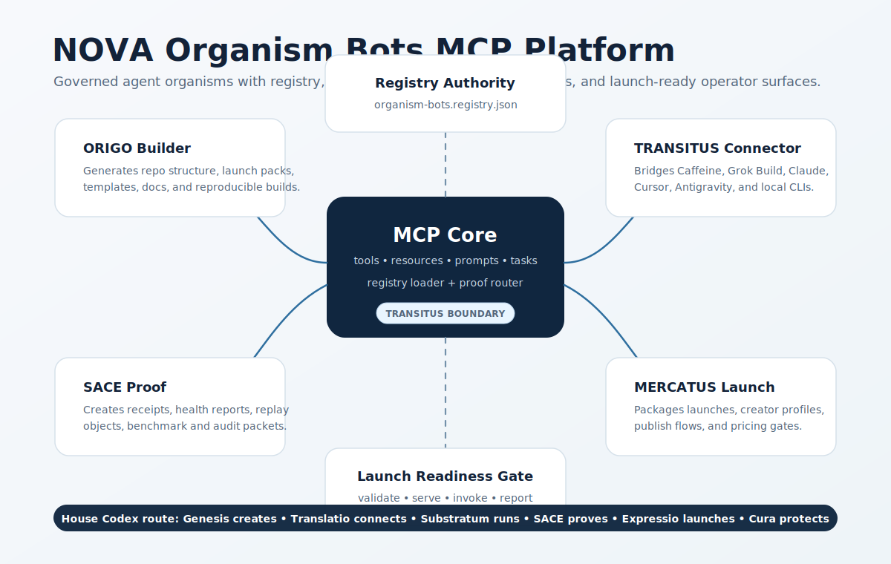

# NOVA Organism Bots MCP



NOVA Organism Bots MCP is a registry-governed platform for launching role-specific AI workflow organisms. It connects repositories, external AI workers, MCP/MTP servers, local terminals, browser workbenches, documents, proof gates, and product launch surfaces through one governed contract.

This is not a chatbot wrapper. It is an operator layer for business-building agents: build, connect, prove, launch, and remember.

## Why It Exists

AI builders can generate code quickly, but production work fails when the surrounding system is missing: registry, permissions, task contracts, proof receipts, launch readiness, consequence memory, and reusable operator workflows.

This repo gives those pieces a shared shape. A bot is not just a prompt. A bot is a governed workflow organ with a role, house, inputs, outputs, proof gates, and launch level.

## What You Can Build

- Caffeine / Grok Build / Claude / Cursor / Antigravity connector bots.
- Repo builder bots that generate production packages and docs.
- Proof bots that create receipts, benchmark reports, and release gates.
- Launch bots for marketplace listings, creator profiles, onboarding flows, and pricing gates.
- Consequence bots that preserve lessons, drift, operator outcomes, and next-build continuity.

## Quick Start

Run the validation gate:

```bash
python tools/validate_organism_registry.py
```

Start the local server:

```bash
python server/organism_bots_server.py --port 8766
```

Inspect health and registry:

```bash
curl http://127.0.0.1:8766/health
curl http://127.0.0.1:8766/registry
curl http://127.0.0.1:8766/tools
```

Submit a dry-run task receipt:

```bash
curl -s -X POST http://127.0.0.1:8766/tasks \
  -H 'Content-Type: application/json' \
  -d @examples/minimal-task.json
```

The first server intentionally creates receipts only. It does not execute arbitrary external code. Real tool execution should be added behind explicit allowlists and proof storage.

## Initial Bot Family

| Bot | House | Role |
| --- | --- | --- |
| ORIGO Builder Bot | Genesis | Build repos, launch packs, templates, docs, and reproducible releases |
| TRANSITUS Connector Bot | Translatio | Bridge external AI workers, MCP/MTP servers, CLIs, IDEs, and browser workbenches |
| SACE Proof Bot | Substratum | Create receipts, benchmark trails, audit records, and readiness gates |
| MERCATUS Launch Bot | Expressio | Prepare product launch surfaces, creator profiles, guided onboarding, and pricing advisors |
| MEMORIA Consequence Bot | Cura | Preserve decisions, failures, lessons, drift, and next-build continuity |

## Repository Map

- `organism-bots.registry.json` — machine-readable bot family registry.
- `mcp/organism-bots.mcp.json` — MCP-style resource/tool contract.
- `server/organism_bots_server.py` — dependency-free runnable development server.
- `tools/validate_organism_registry.py` — dependency-free validation gate.
- `examples/minimal-task.json` — sample task invocation payload.
- `skills/organism-bot-orchestrator/SKILL.md` — agent activation workflow.
- `research/ORGANISM_BOTS_PLATFORM_RESEARCH.md` — deep platform paper.
- `docs/ORGANISM_BOTS_WORKING_PAPER.md` — concise working paper for the product architecture.
- `docs/PRODUCT_READINESS.md` — launch levels, product views, and next gates.

## Launch Levels

| Level | Name | Gate |
| --- | --- | --- |
| L0 | Draft | Concept and role only |
| L1 | Registered | Registry validates |
| L2 | Runnable | Server loads bot and accepts task |
| L3 | Proved | Receipt and replay path exist |
| L4 | Marketable | Docs, UX, security posture, and support path exist |

Current state: L2 is present for the platform substrate. L3 is partially present through deterministic receipts. The next hardening step is persistent receipt storage plus CI validation.

## Operating Law

- No organism bot can claim completion without an artifact or proof record.
- External AI systems are connected through bounded handoff contracts, not treated as the whole intelligence.
- Registry law comes before runtime action.
- Tool execution must be allowlisted and receipt-backed.
- Market-facing launch claims require validation, reproducible operation, and operator-readable limits.

## Product Direction

This repo should become the MCP-facing organism control plane for NOVA Build: choose a bot, connect a surface, submit a task, inspect proof, import artifacts, and promote the result into a launch package.

Next build: add persistent receipts, CI checks, a CLI wrapper, and the browser dashboard for bot selection and task inspection.
